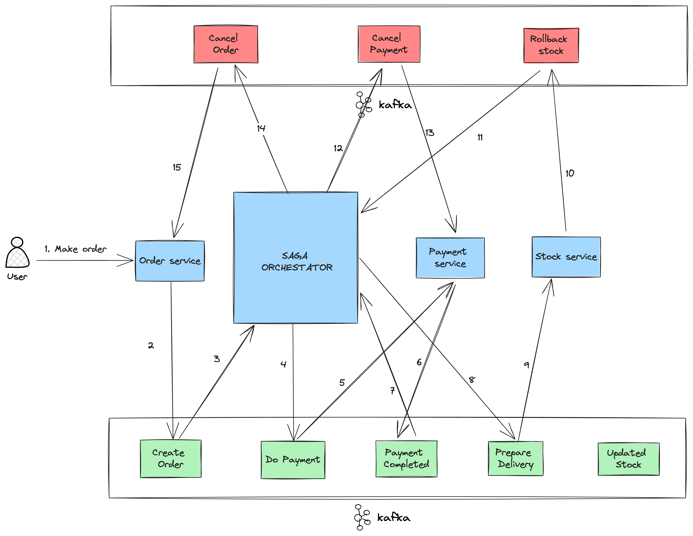

# Saga Pattern Implementation For Distibuted Payment Transactions
A demonstration project for handling long-running Payment Transactions in Microservice Architecture using Nodejs, Kafka, MongoDB

# Successful Flow:


# Rollback Flow:

## Prerequisites

 - [Kafka](https://kafka.apache.org/downloads)
 - [Nodejs](https://nodejs.org/en/download/)
- [MongoDB](https://www.mongodb.com/try/download/community)


## Setup

### Kafka Setup

``` 
docker compose up -d 
```

### Create topics
```
yarn --cwd ./kafkaBroker start
```

<!-- ### Service Setup -->

### Install packages

```
yarn --cwd ./orchestatorService
```

```
yarn --cwd ./orderService
```

```
yarn --cwd ./paymentService
```


## Run

```
cd orchestatorService && yarn start
```

```
cd orderService && yarn start
```

```
cd paymentService && yarn start
```
