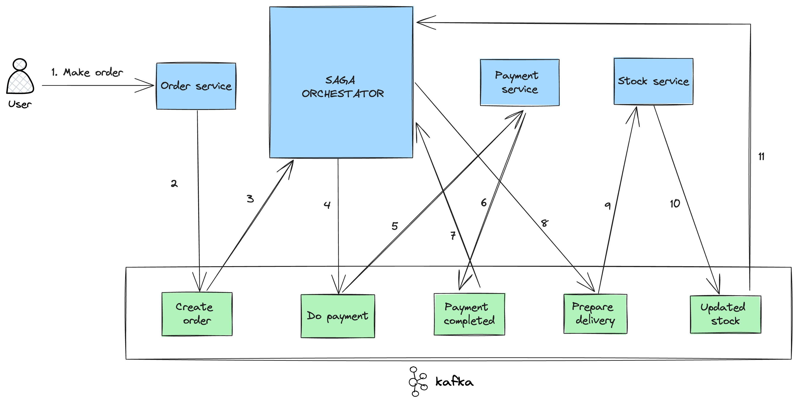

# Saga Pattern Implementation For Distributed Payment Transactions

This project provides a demonstration of effectively managing long-running Payment Transactions within a Microservice Architecture. By utilizing technologies like Node.js, Kafka, and MongoDB, this implementation showcases the Saga Orchestrator pattern.

The Saga Pattern is a powerful technique for orchestrating a series of related tasks in a distributed system. It decomposes complex processes into smaller, manageable steps, ensuring that in case of any failure, compensating actions are taken. This pattern is instrumental in upholding data integrity and reliability in systems with multiple interacting services, particularly in microservices architectures.

For a more comprehensive understanding of the Saga pattern, please refer to [Microservices.io - Saga Pattern](https://microservices.io/patterns/data/saga.html).

## Successful Flow:


## Rollback Flow:


## Prerequisites

Before you begin, make sure you have the following prerequisites installed:

- [Kafka](https://kafka.apache.org/downloads)
- [Node.js](https://nodejs.org/en/download/)
- [MongoDB](https://www.mongodb.com/try/download/community)

## Setup

### Kafka Setup

Initiate Kafka using Docker Compose:

```bash
docker compose up -d 
```

### Install Packages

Install the necessary packages for each service:

```bash
yarn --cwd ./kafkaBroker
```

```bash
yarn --cwd ./orchestratorService
```

```bash
yarn --cwd ./orderService
```

```bash
yarn --cwd ./paymentService
```

### Create Topics

Initialize Kafka topics:

```bash
yarn --cwd ./kafkaBroker start
```

## Running the Services

Start the services in separate terminals:

### Orchestrator Service

```bash
cd orchestratorService && yarn start
```

### Order Service

```bash
cd orderService && yarn start
```

### Payment Service

```bash
cd paymentService && yarn start
```

## Customization and Extension

This project is designed to serve as a foundation for managing distributed payment transactions. However, you can further customize and extend it based on your specific requirements. Some potential areas for customization include:

- Adding additional services or steps to the Saga pattern to handle more complex transaction workflows.
- Incorporating monitoring and logging solutions to gain deeper insights into the transaction process.
- Introducing error handling strategies to enhance fault tolerance and resilience.

Feel free to explore the code and make adjustments to align it with your unique needs.

## Support and Feedback

If you have any questions, encounter issues, or would like to contribute, please don't hesitate to reach out. Your feedback is highly valued!

Happy coding!
